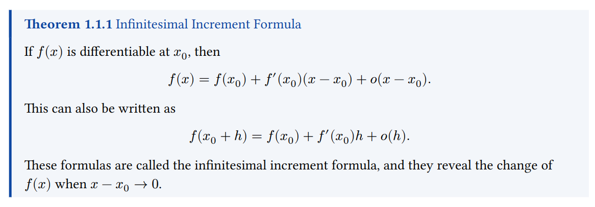

# MetaNote: LaTeX/Typst Template for Everyday Mathematics Note Taking

Welcome to MetaNote, the LaTeX/Typst template designed specifically for everyday mathematics note taking! 

Typesetting should be the least of your concerns when taking notes. MetaNote is designed to be as minimal as possible, so that you can focus on the content of your notes. We've provided you with plenty of environments to get you started, including theorems, definitions, examples, and more. These boxes feature a clean, minimal design with a light background and a coloured line to the left, consistent with the rest of the document.

## Examples

Here are some examples of what you can do with MetaNote.

### Theorems


LaTeX
```

```

Typst
```
#theorem("Infinitesimal Increment Formula")[
  If $f(x)$ is differentiable at $x_0$, then

  $ f(x)=f(x_0)+f'(x_0)(x-x_0)+o(x-x_0). $

  This can also be written as

  $ f(x_0+h)=f(x_0)+f'(x_0)h+o(h). $

  These formulas are called the infinitesimal increment formula, and they reveal the change of $f(x)$ when $x-x_0 -> 0$.
]
```

## Getting Started

If you are fond of LaTeX, you can use the `metanote.tex` file to get started. 

Howeever, if you prefer Typst, you can see the example in the Typst folder. Both `metanote.typ` and `metatheorem.typ` should be copied to your project folder. 

You may also install the package locally. For current beta version, put the contents of the Typst folder in this repo to `{data-dir}/typst/packages/local/MetaNote/0.0.1`.

Here, {data-dir} is

`$XDG_DATA_HOME` or `~/.local/share` on Linux 

`~/Library/Application` Support on macOS 

`%APPDATA%` on Windows 

And you can get started by adding the following line to your Typst file:

```
#import "@local/MetaNote:0.0.1": *
```

Happy note taking!
